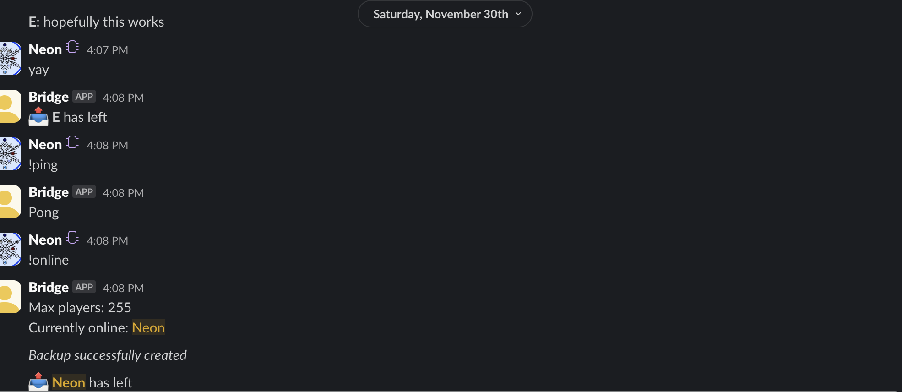

# Terraria <-> Slack

a bridge between slack and terraria.

## Features

- Slack to Terraria communication
- Commands support for users
- Terminal support (into slack channel)

## Setup

1. Copy `.env.example` to `.env`
2. populate the `.env` file
3. Modify `src/config.js` to your needs
4. Start the server by using `node src/index.js` OR `sudo node src/index.js` (incase you cant use docker from your user)

## Just for high seas reviewer:

NO TUTORIAL CODE WAS USED
ALL ORIGINAL CODE
